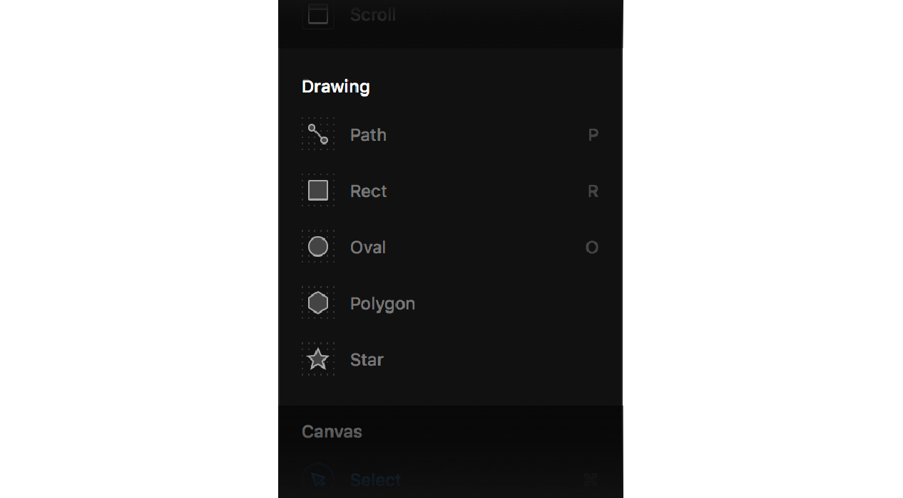

# Drawing \(WIP\)

Apart from being a great layout tool, Framer is also the tool to create your icons and logos in. We have a wide set of options for you to create with:

## Path

Our Path tool features everything that you want and need. When drawing icons, you’ll often rely on geometric shapes as the foundation of your glyph. Framer X its path tool helps you along the way. While drawing or editing a path, we’ll suggest the _calculated center point_ for you—so you can quickly find and snap to these points along your segment.

Our path tool also helps you with defining diagonal lines, continuing along the exact angle of a previous segment is tricky. Our path editing tool does the hard work for you—once your cursor comes close enough, we’ll lock your angle for you, so you can draw perfectly aligned icons and illustrations.

### Editable segments

Press Enter or double-click on a shape, and hover over any line to drag entire segments at once. This comes in handy for rapid editing of more complex shapes.

### **Curving**

Curve Bending uses synchronized anchor points to guide you closer to your desired curvature, allowing for more advanced illustration work. This is especially helpful if you’re departing from geometric shapes and into the realm of freeform drawing. Click and drag any anchor point to bend and twist the path into more organic forms.  

## Shapes

Insert rectangles, ovals, polygons, and stars, then use them as a starting point for more advanced shapes. Shortcuts: Type **R** for rectangle, **O** for oval. You can even create polygons or stars. Double-click to edit and customize completely.

If you want shapes to act upon layout rules like any other layer, you can wrap them in a Frame by selecting the shape and pressing **Enter**. This way the Frame will act like a smart container to the shape.

## Boolean operations

You might find yourself creating a shape that is not among our standard set of shapes and so you will have to create this by yourself. You can of course do this by using our Path tool and build it from the ground up, but often times you will find that this shape is easy to recreate by using boolean operations. Our boolean operations support functions to add, subtract, intersect, and exclude shapes. This will let you create complex shape with ease.

## SVG-ready

We created our Drawing tool with output as top of mind. Being both SVG-driven and browser-based allows anything designed in Framer X to be rendered 1:1 across all screen sizes and resolution. And when you export SVG icons to use on your website, you’ll appreciate our clean, cruft-free code. To quickly copy, right-click on any shape and click Copy &gt; Copy SVG. Alternatively, you can hit Export and export it as an SVG file.

## Tutorial

Find out more about our Drawing tools via our YouTube channel: [https://www.youtube.com/watch?v=X0CRhT2WZZ0&list=PL9p5auxyrweNVMAzsrEd9DmsM25U8ij1M&index=4&t=0s](https://www.youtube.com/watch?v=X0CRhT2WZZ0&list=PL9p5auxyrweNVMAzsrEd9DmsM25U8ij1M&index=4&t=0s)

