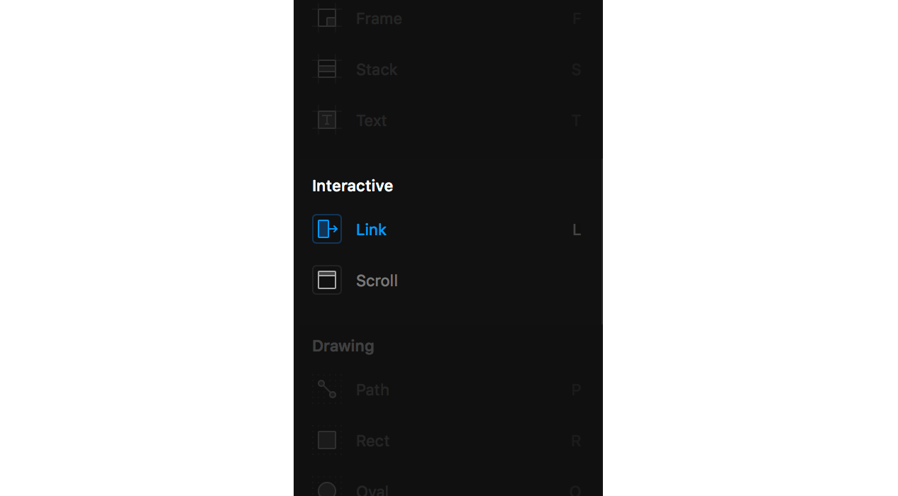
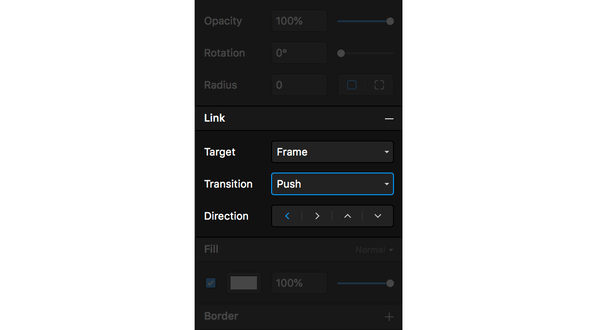
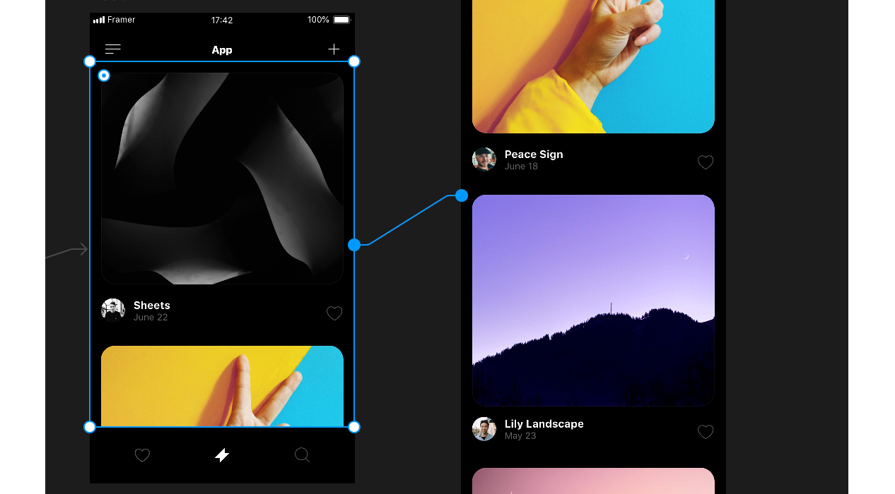
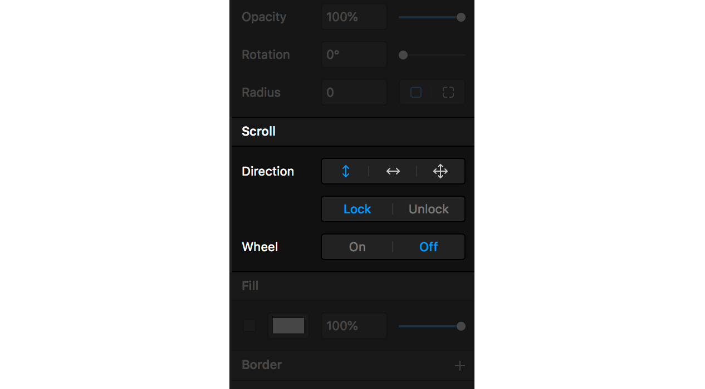

# Interactive \(WIP\)

## Link tool

### How it works

Framer X comes with a built-in Link tool. Simply by selecting the tool \(or using the shortkey "L"\) you will be able to connect one Frame and draw a line to another \(or by selecting the target from the properties window\) and you will be able to create an advanced flow in a matter of seconds, without any coding involved!

### Options

The Link tool also comes with a wide variety of options that you can choose from. There are different transitions that you can pick from to get your flow working just the way you want it to. These transitions are:

* Push
* Overlay
* Modal
* Instant
* Flip

## Scroll tool

### How it works

The Scroll tool will allow you to quickly draw an invisible area on top of a selection which will immediately become scrollable. Once created, you can link this to any Frame, which will mirror the content inside of your Scroll area. Make an update in the Frame and it will be reflected in your Scrollable area immediately.

### Options

### 

The Scroll tool also lets you choose which directions you can use your scrolling: horizontally, vertically or both. You can also select if you want the mouse wheel turned on or off, so that you can perfectly simulate a mobile experience.

### Nesting

The Scroll tool also comes with nesting capabilities. So it is now possible to put a vertical scrollable area within a horizontal scrollable area. Perfect for when you are creating advanced prototypes!

## Tutorial

Find out more about our Interactive tools via our YouTube channel: [https://www.youtube.com/watch?v=ScClAQr-8Bo&list=PL9p5auxyrweNVMAzsrEd9DmsM25U8ij1M&index=6&t=0s](https://www.youtube.com/watch?v=ScClAQr-8Bo&list=PL9p5auxyrweNVMAzsrEd9DmsM25U8ij1M&index=6&t=0s)

